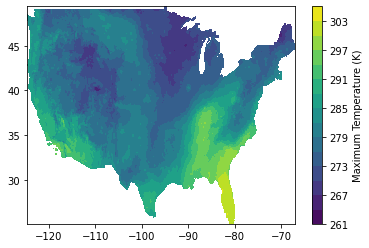

Start by importing the GridMet class from *pymt* and creating an
instance.

.. code:: ipython3

    from pymt.models import GridMet
    m = GridMet()

Next, use the *setup* method to assign values to the ``start_date`` and
``end_date`` parameters.
(Note that the parameter names aren't prefixed with an underscore
like in the configuration file.)

.. code:: ipython3

    args = m.setup(start_date="2021-01-01", end_date="2021-01-03")

Pass the results from *setup* into the *initialize* method.

.. code:: ipython3

    m.initialize(*args)

Note that the parameters have been correctly assigned in the component.

.. code:: ipython3

    for param in m.parameters:
        print(param)

.. parsed-literal::

    ('start_date', '2021-01-01')
    ('end_date', '2021-01-03')

As in the previous example, get the maximum temperature values for the
first day.

.. code:: ipython3

    Tmax = m.var["daily_maximum_temperature"]
    Tmax_values = Tmax.data

To make this example a little more interesting, let’s visualize the
maximum temperature data.

The *pymt_gridmet* component contains not only data values, but also the
grid on which they’re defined. Start by getting the identifier for this grid.

.. code:: ipython3

    gid = m.var_grid("daily_maximum_temperature")

Using the grid identifier, we can get the grid dimensions, origin, and
node spacing.

.. code:: ipython3

    shape = m.grid_shape(gid)
    origin = m.grid_origin(gid)
    spacing = m.grid_spacing(gid)

    print("shape:", shape)
    print("origin:", origin)
    print("spacing:", spacing)

.. parsed-literal::

    shape: [ 585 1386]
    origin: [  25.06666667 -124.76666663]
    spacing: [ 0.04166667  0.04166667]

From these values, we can construct latitude and longitude vectors.

.. code:: ipython3

    import numpy as np
    
    lat = np.arange(shape[0])*spacing[0] + origin[0]
    lon = np.arange(shape[1])*spacing[1] + origin[1]

We’re almost ready to make a plot. Note, however, that the default
behavior of ``pymt`` components is to flatten data arrays.

.. code:: ipython3

    Tmax_values.shape

.. parsed-literal::

    (810810,)

Make a new variable that restores the dimensionality of the data.

.. code:: ipython3

    Tmax_values_2D = Tmax_values.reshape(shape)
    Tmax_values_2D.shape

.. parsed-literal::

    (585, 1386)

Make a simple filled contour plot of the data with a colorbar.

.. code:: ipython3

    import matplotlib.pyplot as plt
    
    plt.contourf(lon, lat, Tmax_values_2D, 15)
    plt.colorbar(label="Maximum Temperature (K)")

Complete the example by finalizing the component.

.. code:: ipython3

    m.finalize()
